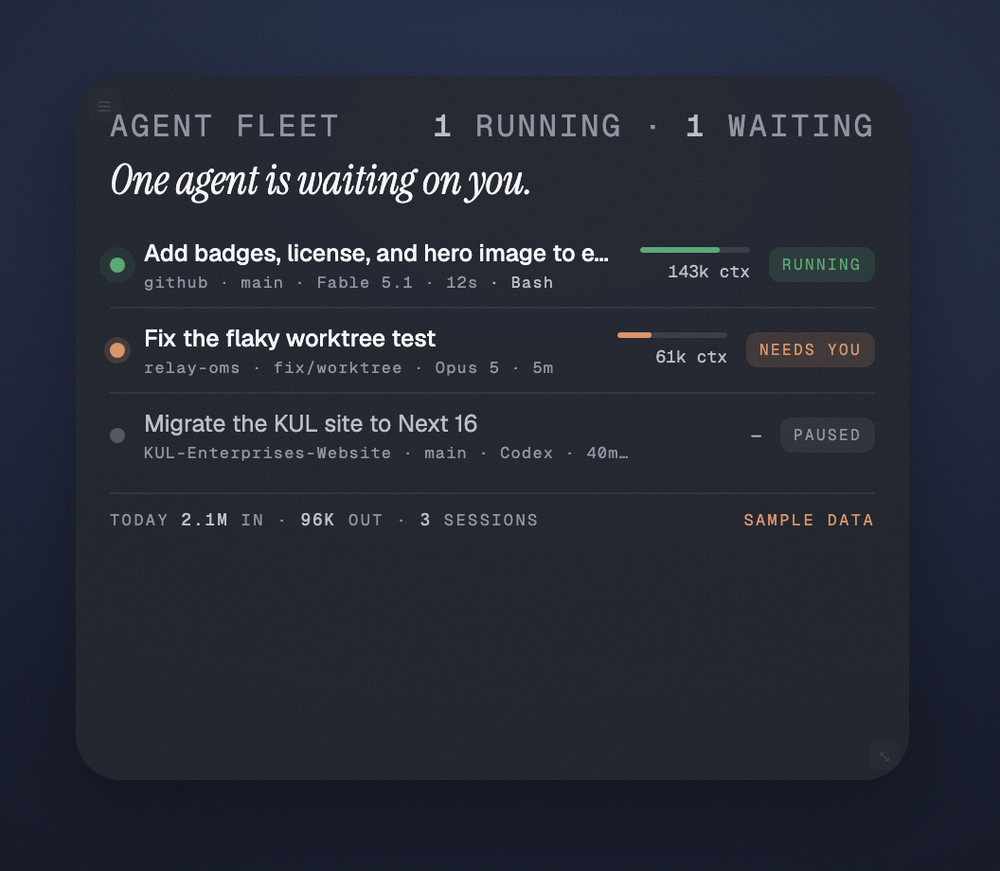

# agent-fleet

> Every coding-agent session on your Mac: what each is doing, which ones are waiting on you, and today's tokens.

[](https://github.com/jke48222/agent-fleet-widget/releases/latest) [](LICENSE) 

[Übersicht gallery](https://tracesof.net/uebersicht-widgets/) · [Widget suite](https://github.com/jke48222/widget-suite) · [Download](https://github.com/jke48222/agent-fleet-widget/releases/latest) · [Setup guide](docs/SETUP.md) · [Troubleshooting](docs/TROUBLESHOOTING.md)

A widget for [Übersicht](http://tracesof.net/uebersicht/), self-contained in
`index.jsx`. It reads the session logs that Claude Code and Codex already write
(`~/.claude/projects`, `~/.codex/sessions`) and shows each session's title,
project, branch, model, last tool call, the context it carried into its last
turn, and a status: **running**, **needs you**, **paused**, or **idle**. The
footer totals today's input and output tokens across every session. Read-only;
nothing is sent anywhere. The helper mirrors its JSON to
`~/.config/widgetsuite/fleet.json` so the [Window Pet](https://github.com/jke48222/window-pet-widget)
can react to the same sessions.



## Requirements

- macOS with [Übersicht](https://tracesof.net/uebersicht/) installed (`brew install --cask ubersicht`)
- `python3` on the PATH (Xcode Command Line Tools or Homebrew)
- Claude Code and/or Codex, which write the logs the widget reads

## Install

If you don't have Übersicht yet:

```sh
brew install --cask ubersicht
```

**One-click.** Clone the repo and run the installer. It copies the widget into Übersicht's widgets folder, installs any helper scripts, and runs setup if the widget needs it. Safe to re-run.

```sh
git clone https://github.com/jke48222/agent-fleet-widget.git
cd agent-fleet-widget && ./install.sh
```

**Manual.** Download `agent-fleet.widget.zip` from the [latest release](https://github.com/jke48222/agent-fleet-widget/releases/latest), unzip it, and put the `agent-fleet.widget` folder in `~/Library/Application Support/Übersicht/widgets/`. Then refresh Übersicht (menu bar icon → Refresh All).

Blank widget? Run `./check.sh` for a pass/fail diagnosis, or see [docs/TROUBLESHOOTING.md](docs/TROUBLESHOOTING.md).

## How it decides

- **running**: the session's log was written in the last 150 seconds.
- **needs you**: the last assistant turn ended with `end_turn` and a `claude`
  process is alive, so the agent finished and is waiting for your next message.
- **paused**: no activity for up to 45 minutes.
- **idle**: older than that; sessions untouched for 24 hours drop off.
- **ctx**: input plus cache tokens of the last turn, scaled against a 1M window
  for the Claude 5 family and 200k for other models.
- **today**: usage summed since local midnight. The helper keeps an incremental
  cache in `~/.config/widgetsuite/fleet-cache.json` so refreshes read only what
  was appended since the last run, which keeps each refresh under 100 ms.

Titles come from the session's own title (custom or generated) or, failing
that, its last prompt. Codex sessions are best effort: project, status, and
the first prompt.

## Customization

- `refreshFrequency` (10 s), `ROWS` (5), and the card size are constants above the component.
- The status thresholds are at the bottom of the embedded helper; `setup/fleet.py` is the same script as a standalone file, handy for testing with `python3 setup/fleet.py | python3 -m json.tool`.
- All visual styling is in the inlined design-system block at the top of `index.jsx`.

## Bundled files

- `agent-fleet.widget/index.jsx` — the widget, helper embedded
- `setup/fleet.py` — the same helper as a file, for reading and testing
- `install.sh` / `install.command` — one-click installer (copies the widget into Übersicht and installs any helpers)
- `check.sh` — read-only setup diagnostics; prints pass/fail per item

## Related widgets

Part of the [Übersicht Widget Suite](https://github.com/jke48222/widget-suite): 16 widgets that share one design system.

- [Animated Wallpaper](https://github.com/jke48222/animated-wallpaper-widget)
- [Clipboard History](https://github.com/jke48222/clipboard-history-widget)
- [Daily AI Prompt](https://github.com/jke48222/daily-ai-prompt-widget)
- [Daily Astronomy Photo](https://github.com/jke48222/daily-astronomy-photo-widget)
- [Daily Tarot](https://github.com/jke48222/daily-tarot-widget)
- [GitHub Contributions](https://github.com/jke48222/github-contributions-widget)
- [Now Playing](https://github.com/jke48222/now-playing-widget)
- [Recent Album Covers](https://github.com/jke48222/recent-album-covers-widget)
- [Recent Downloads](https://github.com/jke48222/recent-downloads-widget)
- [Rotating 3D Model](https://github.com/jke48222/rotating-3d-model-widget)
- [Spinning Globe](https://github.com/jke48222/spinning-globe-widget)
- [Wallpaper Switcher](https://github.com/jke48222/wallpaper-switcher-widget)
- [Keys & Pads](https://github.com/jke48222/keys-and-pads-widget)
- [Pi Fleet](https://github.com/jke48222/pi-fleet-widget)
- [Window Pet](https://github.com/jke48222/window-pet-widget)

## License

MIT. See [LICENSE](LICENSE).

## Author

Jalen Edusei <jalen.edusei@gmail.com>
